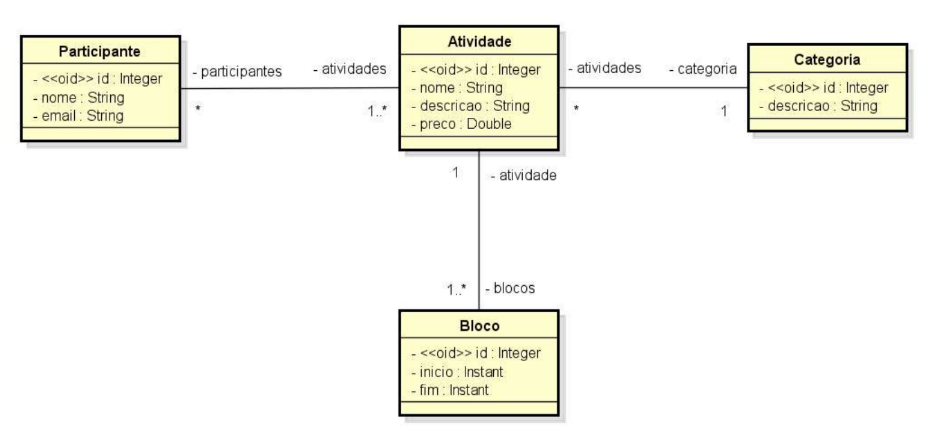
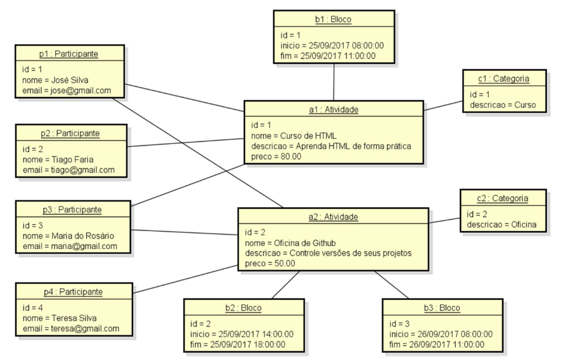

## Dev superior - Spring Boot

### Desafio - Modelo de domínio e ORM

 - Criar um projeto no Spring Boot com Java e banco de dados H2, e implementar o modelo
   conceitual conforme especificação a seguir. Além disso, você deve fazer o seeding da base de dados
   conforme diagrama de objetos que segue.

###### Especificação - Sistema EVENTO
 - Deseja-se construir um sistema para gerenciar as informações dos participantes das atividades de um
evento acadêmico.
 - As atividades deste evento podem ser, por exemplo, palestras, cursos, oficinas
práticas, etc. 
 - Cada atividade que ocorre possui nome, descrição, preço, e pode ser dividida em vários
blocos de horários (por exemplo: um curso de HTML pode ocorrer em dois blocos, sendo necessário
armazenar o dia e os horários de início de fim do bloco daquele dia). 
 - Para cada participante, deseja-se cadastrar seu nome e email.



###### Instância dos dados para seeding



###### Queries para verificar os dados
 - Listar todos os participantes com suas atividades e categorias, ordenados pelo nome do participante.
```sql
SELECT PA.ID AS PART_ID, PA.NOME AS PART_NOME, PA.EMAIL AS PART_EMAIL, AT.ID AS ATIV_ID, AT.NOME AS ATIV_NOME, AT.DESCRICAO AS ATIV_DESC, AT.PRECO AS ATIV_PRECO, CAT.ID AS CAT_ID, CAT.DESCRICAO AS CAT
FROM TB_ATIVIDADE_PARTICIPANTE AP
INNER JOIN TB_PARTICIPANTE PA ON PA.ID = AP.PARTICIPANTE_ID
INNER JOIN TB_ATIVIDADE AT ON AT.ID = AP.ATIVIDADE_ID
INNER JOIN TB_CATEGORIA CAT ON CAT.ID = AT.CATEGORIA_ID
ORDER BY PA.NOME;
```

 - Listar as atividades com seus blocos de horários
```sql
SELECT BL.ID AS BL_ID, BL.INICIO AS INICIO, BL.FIM AS FIM, AT.ID AS AT_ID, AT.NOME AS AT_NOME, AT.DESCRICAO AS AT_DESCRICAO
FROM TB_BLOCO BL
INNER JOIN TB_ATIVIDADE AT ON AT.ID = BL.ATIVIDADE_ID
```