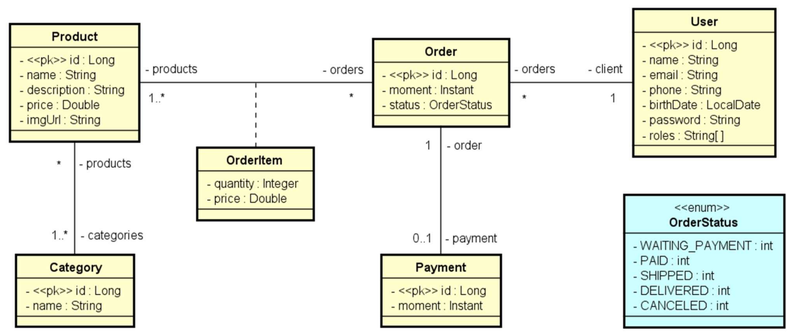

## Dev superior - Spring Boot

#### Atividades - Desavios
 - Desafio Componentes e injeção de dependências: 
```bash 
git checkout componentes_injecao_de_depenpendencia
```  
 - Desafio Modelo de domínio e ORM: 
```bash
git checkout modelo_dominio_orm
```

###### Overview
 - O sistema deve manter um cadastro de usuário, produtos e suas categorias. 
 - Cada usuário possui nome, email, telefone, data de nascimento e uma senha de acesso. 
 - Os dados dos produtos são: nome, descrição, preço e imagem. 
 - O sistema deve apresentar um catálogo de produtos, os quais podem ser filtrados pelo nome do produto. 
 - A partir desse catálogo, o usuário pode selecionar um produto para ver seus detalhes e para decidir se o adiciona a um carrinho de compras. 
 - O usuário pode incluir e remover itens do carrinho de compra, bem como alterar as quantidades de cada item. 
 - Uma vez que o usuário decida encerrar o pedido, o pedido deve então ser salvo no sistema com o status de "aguardando pagamento". 
 - Os dados de um pedido são: instante em que ele foi salvo, status, e uma lista de itens, onde cada item se refere a um produto e sua quantidade no pedido. 
 - O status de um pedido pode ser: aguardando pagamento, pago, enviado, entregue e cancelado. Quando o usuário paga por um pedido, o instante do pagamento deve ser registrado. 
 - Os usuários do sistema podem ser clientes ou administradores, sendo que todo usuário cadastrado por padrão é cliente. 
 - Usuários não identificados podem se cadastrar no sistema, navegar no catálogo de produtos e no carrinho de compras. 
 - Clientes podem atualizar seu cadastro no sistema, registrar pedidos e visualizar seus próprios pedidos. 
 - Usuários administradores tem acesso à área administrativa onde pode acessar os cadastros de usuários, produtos e categorias.

###### Modelo conteitual
 - Cada item de pedido (OrderItem) corresponde a um produto no pedido, com uma 
   quantidade. Sendo que o preço também é armazenado no item de pedido por
   questões de histórico (se o preço do produto mudar no futuro, o preço do item de
   pedido continua registrado com o preço real que foi vendido na época).
 - Um usuário pode ter um ou mais "roles", que são os perfis de acesso deste usuário
   no sistema (client, admin).



###### Casos de uso (overview)
| **Caso de uso**     | **Visão geral**                                                                                         | **Acesso**     |
|---------------------|---------------------------------------------------------------------------------------------------------|----------------|
| Manter produtos     | CRUD de produtos, podendo filtrar itens pelo nome                                                       | Somente Admin  |
| Manter categorias   | CRUD de categorias, podendo filtrar itens pelo nome                                                     | Somente Admin  |
| Manter usuários     | CRUD de usuários, podendo filtrar itens pelo nome                                                       | Somente Admin  |
| Gerenciar carrinho  | Incluir e remover itens do carrinho de compras, bem como alterar as quantidades do produto em cada item | Público        |
| Consultar catálogo  | Listar produtos disponíveis, podendo filtrar produtos  pelo nome                                        | Público        |
| Sign up             | Cadastrar-se no sistema                                                                                 | Público        |
| Login               | Efetuar login no sistema                                                                                | Público        |
| Registrar pedido    | Salvar no sistema um pedido a partir dos dados do  carrinho de compras informado                        | Usuário logado |
| Atualizar perfil    | Atualizar o próprio cadastro                                                                            | Usuário logado |
| Visualizar pedidos  | Visualizar os pedidos que o próprio usuário já fez                                                      | Usuário logado |
| Registrar pagamento | Salvar no sistema os dados do pagamento de um  pedido                                                   | Somente Admin  |
| Reportar pedidos    | Relatório de pedidos, podendo ser filtrados por data                                                    | Somente Admin  |

###### Atores
| **Ator**        | **Responsabilidade**                                                                                                                                          |
|-----------------|---------------------------------------------------------------------------------------------------------------------------------------------------------------|
| Usuário anônimo | Pode realizar casos de uso das áreas públicas do sistema, como  catálogo, carrinho de compras, login e sign up.                                               |
| Cliente         | Responsável por manter seu próprios dados pessoais no sistema, e pode visualizar histórico dos seus pedidos. Todo usuário cadastrado por padrão é um Cliente. |
| Admin           | Responsável por acessar a área administrativa do sistema com cadastros e relatórios. Admin também pode fazer tudo que Cliente faz.                            |
